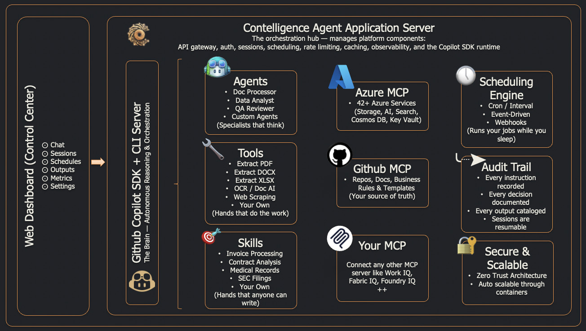
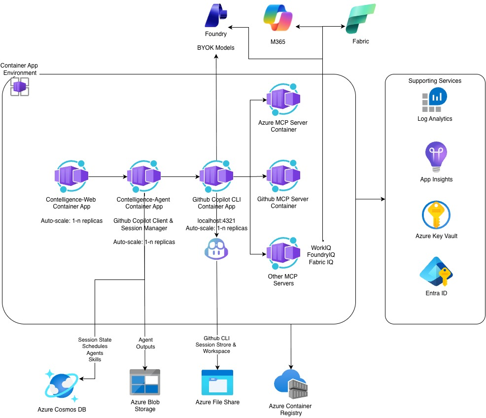

<h1>&nbsp;&nbsp;Contelligence</h1>


**GitHub Copilot changed how developers work. Contelligence brings that same power to everyone else.**
> Tell it what you need. In plain English. It does the rest.

[](#status)
[](#what-is-contelligence)
[](#azure-deployment--web-app)
[](LICENSE)

---

## What is Contelligence?

GitHub Copilot is incredible for coding — but the same agentic platform that makes it brilliant at code also makes it brilliant at *work*. Summarizing documents, pulling reports, processing invoices, automating repetitive tasks — it's all just orchestration. And most people who need that help the most will never open a terminal.

**That's what Contelligence does.** It brings the power of GitHub Copilot to every user — for day-to-day tasks, in plain English, right from the desktop. An AI-native, agentic content intelligence platform powered by GitHub Copilot CLI and SDK that replaces brittle pipelines with an autonomous AI agent. It reasons step-by-step, ingests any content — documents, spreadsheets, presentations, web pages, audio, images — understands data by meaning, and delivers structured intelligence. All orchestrated through natural language.

**Two ways to run — same powerful agent:**

- **Contelligence Cowork** — Native desktop app (macOS, Windows, Linux). Install it, launch it, start talking to the agent. Zero cloud infrastructure required.
- **Contelligence Web** — Azure-deployed web app for teams. Multi-user, enterprise-grade, with full Azure service integration.


## The Problem

GitHub Copilot proved that AI can handle complex, multi-step work autonomously — for developers. But most knowledge workers are still stuck doing everything manually: summarizing documents, pulling reports, reconciling invoices, monitoring channels, filling timesheets. The tools exist to automate all of this, but they require pipelines, code, and engineering effort that everyday users will never build.

The result: people spend hours on repetitive content tasks that an AI agent could handle in seconds — if only someone built the bridge.  

## The Solution

Contelligence is that bridge. It wraps the GitHub Copilot SDK in a desktop app that anyone can use. Describe what you need in **plain English** — the agent reasons about what to do, picks the right tools, connects to any MCP server for extended capabilities, ingests content from any format, understands data semantically, and delivers structured results.

**No pipelines. No code.**


## Contelligence Cowork — Desktop App

[](#-setup-steps)
[](#-setup-steps)
[](#-setup-steps)

**Contelligence Cowork** is the desktop application — a fully self-contained, native experience that bundles the AI agent, backend, and UI into a single installable app. No cloud account, no Docker, no infrastructure setup. Download, install, and start processing content with AI immediately.


### What Contelligence Cowork Does

Contelligence Cowork puts the full power of the Contelligence agent on your desktop:

- **Chat with an AI agent** that understands documents, spreadsheets, presentations, images, audio, and web content
- **Analyze content across multiple documents** — the agent reasons over your entire corpus, not just individual files
- **Automate repetitive tasks** — set up scheduled jobs for day-to-day workflows like monitor channels, pull reports, and more
- **Create custom agents** with specialized personas, restricted tool sets, and domain expertise
- **Build and manage skills** — reusable knowledge packages that teach the agent domain-specific workflows
- **Track everything** — full session history, tool call logs, metrics, and audit trail

### Prerequisites & Installation

| Requirement | Details |
|-------------|---------|
| **Operating System** | macOS 12+, Windows 10+ |
| **GitHub account** | With an active [GitHub Copilot](https://github.com/features/copilot) subscription (Individual, Business, or Enterprise) |
| **GitHub Copilot CLI** | Required for agent reasoning |
| **Azure CLI** (optional) | Required only if connecting to Azure services (Blob, Cosmos, AI Search, etc.) |
| **Disk space** | ~200 MB for the application + space for your documents and local database |

## 🔌 Setup Steps

1. **Download and install Contelligence Cowork**

   **Download the latest release from GitHub**: [Releases](https://github.com/nadeemis/contelligence/releases)

   - [](https://github.com/nadeemis/contelligence/releases/download/v0.1.0/Contelligence-0.1.0.Setup.exe): Squirrel installer (`.exe`) → auto-installs and creates shortcuts
   - [](https://github.com/nadeemis/contelligence/releases/download/v0.1.0/Contelligence-darwin-arm64-0.1.0.zip): `.zip` archive → extract and move to Applications
   
2. **Install GitHub Copilot CLI** (if not already installed)  
   Detailed instructions for Copilot CLI setup can be found in the [GitHub Copilot CLI Docs](https://docs.github.com/en/copilot/how-tos/copilot-cli/cli-getting-started).

   ```bash
   # Cross platform installation of GitHub Copilot CLI, requires Node.js 22+.
   npm install -g @github/copilot

   # Windows - in a PowerShell terminal run:
   winget install GitHub.Copilot

   # macOS - using Homebrew, run:
   brew install copilot-cli
   ```
   
   _Make sure you're signed in to your GitHub account with an active Copilot subscription._
   ```bash
   
   # run copilot
   copilot

   # Authenticate - run in the Copilot CLI terminal:
   /login
   ```

3. **Launch the app**

   Contelligence Cowork automatically starts the backend, finds an available port, and opens the UI. The agent is ready when the dashboard loads.

4. **(Optional) Advanced configuration**

   On first launch, Contelligence Cowork creates a `.env` file at:
   - `{HOME_DIR}/.contelligence/.env`

   Optional parameters include:
   - `COPILOT_GITHUB_TOKEN` — A GitHub PAT with `copilot` scope (alternative to CLI-based auth)
   - `AZURE_*` — Azure service endpoints for cloud features

5. **(Optional) Connect to Azure**

   If you have Azure resources and want advanced features (OCR via Document Intelligence, vector search via AI Search, cloud storage):
   ```bash
   az login
   ```
   Contelligence Cowork checks Azure CLI status on startup and shows a warning if not authenticated. You can use the app fully without Azure — local storage mode works out of the box.


### Getting Started — Your First Conversation

Open Cowork, click **Chat**, and type a natural language instruction. The agent figures out the rest.

| Category | Sample Prompt |
|----------|--------------|
| **Teams & Communication** | *"Pull the last 50 messages from the product-launches channel in Teams, summarize the key decisions, and list all action items with owners. Write the output at \<file_path\>"* |
| | *"Check my Teams chats from the past week — find any messages where I was @mentioned and create a prioritized to-do list. Send the message to myself on Teams."* |
| | *"Read the Engineering team's General channel in Teams, identify all open questions that haven't been answered, and draft suggested responses. Write the output at \<file_path\>"* |
| | *"Get my calendar events for this week and cross-reference with the project-updates channel — flag any meetings where pre-read documents were shared but I haven't reviewed them."* |
| **Browser & Web Research** | *"Navigate to our company's public status page, extract the current uptime percentages for each service, and produce a summary table. Write the output at \<file_path\>"* |
| | *"Go to the SEC EDGAR page for \<company\>, download the latest 10-K filing, and extract the risk factors section. Write the output at \<file_path\>"* |
| | *"Open our internal wiki at \<url\>, navigate to the onboarding checklist page, and extract every task into a structured JSON list."* |
| **DevOps & Bug Triage** | *"Query all active bugs in the \<org\>/\<project\> Azure DevOps project, search the web for known fixes or workarounds for each one, and produce a triage report with suggested resolutions and links to relevant Stack Overflow or GitHub issues."* |
| | *"Fetch the top 10 highest-priority work items from \<org\>/\<project\> in Azure DevOps, browse the error messages on the web to find root-cause analysis patterns, and generate a recommended fix plan with references for each item."* |
| **Multi-Source Intelligence** | *"Pull last week's messages from the #sales-deals channel in Teams, combine with the pipeline spreadsheet at \<file_path\>, and produce a deals-at-risk report with context from both sources."* |
| | *"Scrape the competitor's pricing page at \<url\>, compare against our pricing sheet at \<file_path\>, and generate a competitive pricing analysis with recommendations."* |
| | *"Read the RFP document at \<file_path\>, browse the client's website at \<url\> for background, then pull our past proposals from Teams — draft a tailored response outline."* |
| | *"Gather the meeting notes from Teams (last 2 weeks of the #engineering channel), combine with the project plan at \<file_path\> and the Jira board at \<url\> — produce a status report highlighting blockers and timeline risks."* |
| | *"Extract data from the invoice PDF at \<file_path\>, look up the vendor's current details on their website at \<url\>, cross-check against the approved vendor list spreadsheet at \<file_path\> — flag any mismatches."* |
| **Document Extraction** | *"Extract all the data from the invoice PDF at \<file_path\> — vendor name, invoice number, line items, tax, total — and output it as structured JSON."* |
| | *"Read this Word document at \<file_path\> and summarize the key findings in 5 bullet points."* |
| | *"Extract the financial data from this Excel spreadsheet at \<file_path\>, calculate year-over-year growth for each category, and produce a summary table."* |
| **Multi-Format Ingestion** | *"Ingest the Q3 board pack at \<file_path\> — pull data from the PDF narrative, the Excel financials, and the PowerPoint strategy deck — produce a unified executive summary."* |
| | *"I have 50 scanned invoices as images at \<file_path\>. OCR each one, extract vendor and amount, and output a CSV with all results."* |
| **Cross-Document Intelligence** | *"Analyze all vendor contracts at \<file_path\> from the past 3 years — identify pricing trends, flag terms that have become more aggressive, and surface vendors whose SLAs have degraded over time."* |
| | *"Compare the new draft regulation against our current policy library at \<file_path\> — identify every clause that creates a compliance gap, rank by risk severity, and generate remediation action items."* |
| | *"Gather findings from these 30 research papers and 12 internal experiment reports at \<file_path\> — identify consensus conclusions, conflicting results, and knowledge gaps."* |
| **Content Transformation** | *"Take this customer feedback spreadsheet at \<file_path\> and categorize each entry by sentiment (positive/negative/neutral), topic, and urgency. Output a structured report with statistics."* |
| | *"Convert this technical specification document at \<file_path\> into a non-technical executive briefing — keep the key decisions and risks, remove the implementation details."* |
| **Competitive & Market Analysis** | *"Ingest the last 8 quarterly earnings transcripts from our top 5 competitors at \<file_path\>, extract strategic themes, compare R&D investment signals, and produce a competitive landscape report."* |
| | *"Analyze these 20 product reviews and 15 support tickets at \<file_path\> — what are the top 3 issues customers are reporting? Are there any patterns the product team should act on?"* |


### Using Custom Agents

Create a specialized agent in the **Agents** page, then select it in chat:

> *Agent: "legal-contract-reviewer"*
> *Prompt: "Review this vendor agreement at <file_path>. Flag any non-standard indemnification clauses, unfavorable liability caps, and auto-renewal terms. Compare against our standard template."*

> *Agent: "medical-records-analyst"*
> *Prompt: "Extract patient demographics from these intake forms at <file_path>. Apply PHI redaction rules. Validate all ICD-10 codes."*

### Using Skills

Activate a skill in the chat to give the agent domain expertise:

> *Prompt: "Using the skill invoice-processing, process all invoices in this folder at <file_path>. The skill knows our field mappings — vendor name, PO number, line items, tax, total. Validate amounts and flag any credit notes."*

### Scheduling Automated Workflows

Set up recurring jobs in the **Schedules** page:

- **Nightly financial close**: Cron `0 2 * * *` — *"Collect all transactions from today, reconcile against source documents, flag discrepancies, generate GL entries."*
- **Weekly contract monitoring**: Every Monday at 9 AM — *"Scan all active contracts for upcoming deadlines, expiring terms, and unmet obligations. Generate an action-item report."*
- **On-demand QA**: Webhook trigger — *"Sample 10% of this week's processed content, validate extraction accuracy, generate a quality report with confidence scores."*
- **Ad-hoc research**: Interval trigger every 4 hours — *"Monitor the #industry-news channel in Teams, extract any new articles or reports shared, summarize key insights, and compile into a daily digest."*

### Contelligence Tools
Contelligence Cowork includes many built-in tools for content ingestion, transformation, analysis, and automation. The agent selects the right tools based on your instruction, but you can also specify tool usage in your prompt.

List of tools currently available:
| Tool Group | Description |
|-----------|-------------|
| Desktop | Read, list, or write files on the local desktop filesystem.|
| Extraction | Extract structured data from documents (PDF, Word, Excel, PowerPoint) and images |
| Browser Automation | Navigate web pages, scrape content, interact with forms, and automate web tasks |
| Microsoft Teams | Pull messages, post updates, manage channels, and integrate with Teams content |
| Azure DevOps | Query work items, pull reports, and integrate with Azure DevOps projects |
| SharePoint | Access files and data stored in SharePoint sites |
| Power BI | Query datasets, pull reports, and integrate with Power BI workspaces |
| Azure Storage | Store and retrieve files from Azure Blob Storage |

Detailed documentation for each tool, including usage examples and best practices, can be found in the [Tool Reference](docs/TOOLS.md).

---

### How It Works

Cowork is an [Electron](https://www.electronjs.org/) application that **automatically launches a Python FastAPI backend** as a child process on startup. There is no manual server configuration:

1. You launch Cowork
2. The app finds an available port and starts the backend
3. The agent is ready to receive instructions in seconds
4. All data is stored locally on your machine — nothing leaves your device unless you choose to connect to Azure

```
┌──────────────────────────────────────────┐
│           Contelligence Cowork           │
│  ┌────────────────────────────────────┐  │
│  │   React UI (Chromium renderer)     │  │
│  │   Chat · Agents · Skills · Metrics │  │
│  └──────────────┬─────────────────────┘  │
│                 │ HTTP (localhost)       │
│  ┌──────────────▼─────────────────────┐  │
│  │   FastAPI Backend (child process)  │  │
│  │   Copilot SDK · Tools · Scheduler  │  │
│  └──────────────┬─────────────────────┘  │
│                 │                        │
│  ┌──────────────▼─────────────────────┐  │
│  │   Local Storage (SQLite + Files)   │  │
│  │   Sessions · Agents · Skills · Docs│  │
│  └────────────────────────────────────┘  │
└──────────────────────────────────────────┘
```

---

### Development Setup (For Contributors)

#### Prerequisites

| Requirement | Details |
|-------------|---------|
| **Python 3.12+** | Backend runtime |
| **Node.js 22+** | Frontend and Electron build |
| **Docker** + Docker Compose | For full-stack local development with Azure services |
| **Azure CLI** | For provisioning and deployment |
| **GitHub Copilot CLI** | Requires a GitHub account with Copilot subscription |

#### Running Cowork in Development Mode

```bash
# Install backend dependencies
cd contelligence-agent
pip install -r requirements.txt

# Start the backend server (runs on http://localhost:8080 by default)
uvicorn main:app --reload

# Install Cowork frontend dependencies
cd ../contelligence-cowork
npm install

# Start the Electron app in dev mode
# (automatically launches the backend from contelligence-agent/)
npm start
```

In dev mode, the Electron main process spawns `uvicorn main:app` from the sibling `contelligence-agent/` directory. You can also set `CONTELLIGENCE_API_URL=http://localhost:8081/api/v1` in a `.env.local` to point at an external backend.

---

## Azure Deployment — Web App

> ⚠️ **Azure deployment model of Contelligence is in active development and improvements are ongoing.**
> 
> The current web app version delivers core agent capabilities with Azure service integration, but some features from the desktop app (e.g., Outputs page, certain tools) are still being implemented. The desktop app remains the most feature-complete experience while the web app is being built out.


While Contelligence Cowork is designed for individual and small-team use on the desktop, the **Azure deployment** delivers a multi-user, enterprise-grade web application with full Azure service integration.

### What the Azure Deployment Adds

| Capability | Contelligence Cowork (Desktop) | Azure Web App |
|------------|-------------------|---------------|
| **Storage** | SQLite + local filesystem | Cosmos DB (autoscale, global distribution) + Azure Blob Storage (lifecycle policies) |
| **Authentication** | Single-user, no auth required | Entra ID / Azure AD with JWT validation |
| **Authorization** | Full access | Three RBAC roles: `admin`, `operator`, `viewer` |
| **Observability** | Local logs | Application Insights (traces, metrics, alerts, KQL queries) |
| **Secrets** | Local `.env` file | Azure Key Vault with automatic rotation |
| **Scaling** | Single instance | Container Apps with 1–10 replicas, autoscale |
| **Multi-user** | Single user | Team access with session isolation and RBAC |
| **MCP servers** | Via Copilot SDK | Via Copilot SDK |
| **Network security** | Local only | VNet, Private Endpoints, NSGs, Azure Private Link |
| **Audit** | Local session logs | Enterprise audit trail with user attribution |

### When to Use Azure Deployment

- **Team collaboration** — Multiple users need to share agents, skills, and sessions
- **Enterprise compliance** — Entra ID authentication, RBAC, audit trail, data sovereignty requirements
- **Production workloads** — Scheduled jobs across documents stored in Azure Blob, results integrated with other Azure services, need for high availability and scaling
- **Advanced document processing** — OCR for scanned documents via Azure Content Understanding/Document Intelligence
- **Scale** — Auto-scaling backend for high-throughput document processing

### Azure Web App — Unique Capabilities

The web app includes an **Outputs** page (not present in Contelligence Cowork) for browsing session-grouped output artifacts with inline preview for text, JSON, and CSV files, plus direct download.

The web app also supports:
- **Event Grid triggers** — Azure Event Grid subscriptions that fire agent jobs when content arrives in Blob Storage
- **MCP server integration** — Azure MCP Server sidecar providing access to 42+ Azure services (Cosmos DB, Blob Storage, Key Vault, AI Search, and more) directly from the agent
- **Private endpoints** — All Azure services communicate over the Microsoft backbone via Azure Private Link
- **Managed identity** — Zero static credentials; all service-to-service auth flows through system-assigned managed identity

### Deploying to Azure

Contelligence uses the **Azure Developer CLI (`azd`)** for one-command provisioning and deployment.

#### Prerequisites

- [Azure Developer CLI](https://learn.microsoft.com/azure/developer/azure-developer-cli/install-azd) installed
- Azure CLI (`az`) authenticated to your tenant
- Azure subscription with quota for Container Apps, Cosmos DB and Microsoft Foundry

#### One-Command Deployment

```bash
azd auth login
azd up
```

`azd up` performs three steps:

1. **Provision** — deploys Bicep templates in `infra/` to create all Azure resources
2. **Package** — builds Docker images for `agent` and `web` services, pushes to ACR
3. **Deploy** — creates new Container App revisions from the pushed images

You will be prompted for an **environment name** (e.g., `contelligence-dev`) and **Azure location** (e.g., `westus`).

#### What Gets Provisioned

| Resource | Details |
|----------|---------|
| **Container Registry** | Basic SKU — stores agent and web images |
| **Container Apps Environment** | Integrated with Log Analytics |
| **Agent Container App** | 2 CPU / 4 GiB, 1–10 replicas, sticky sessions for SSE |
| **Web Container App** | 0.5 CPU / 1 GiB, 1–5 replicas, nginx reverse proxy |
| **Cosmos DB** | NoSQL, autoscale 4,000 RU/s, 6 containers |
| **Storage Account** | Standard_LRS with lifecycle policies |
| **Key Vault** | RBAC-enabled, soft-delete, purge protection |
| **Log Analytics + App Insights** | 90-day retention, full observability |

#### RBAC — Least-Privilege Managed Identity

The agent Container App receives a system-assigned managed identity with only the roles it needs:

| Role | Target Service |
|------|---------------|
| ACR Pull | Container Registry |
| Storage Blob Data Contributor | Storage Account |
| Search Index Data Contributor | AI Search |
| Cognitive Services OpenAI User | Azure OpenAI |
| Cognitive Services User | Document Intelligence |
| Key Vault Secrets User | Key Vault |
| Cosmos DB Data Contributor | Cosmos DB |

No static credentials. No service principals. All service-to-service auth flows through managed identity.

#### Deployment Outputs

After `azd up`, endpoints are exported to `.azure/<env-name>/.env`:

```
API_URI=https://contelligence-agent.<region>.azurecontainerapps.io
WEB_URI=https://contelligence-web.<region>.azurecontainerapps.io
```

---

## Solution Components


### Backend — `contelligence-agent`

FastAPI application with the GitHub Copilot SDK as the orchestration runtime. Key layers:

- **38 atomic tools** — document extraction (PDF, DOCX, XLSX, PPTX, scanned images via OCR), browser automation, Microsoft Teams & SharePoint integration, Azure DevOps work items, Power BI queries, storage and querying (Blob, Cosmos DB, AI Search), AI operations (embeddings), and local filesystem access. See the full [Tool Reference](docs/TOOLS.md) for details.
- **3 built-in agents** — `doc-processor` (extraction specialist), `data-analyst` (analysis and querying), `qa-reviewer` (validation and confidence scoring). Users can create additional custom agents.
- **Skills system** — Markdown + YAML packages of domain expertise (e.g., invoice processing) with three levels of progressive disclosure. Skills are loaded into agent context on demand.
- **Scheduling engine** — APScheduler + distributed locking. Supports cron, interval, Event Grid, and webhook triggers.
- **Human-in-the-loop approvals** — Destructive operations trigger approval gates with configurable timeouts.
- **Session persistence** — Full conversation history, tool call logs, output artifacts, and metrics stored for audit and replay.
- **Dual storage mode** — `STORAGE_MODE=local` (SQLite + filesystem for Cowork) or Azure (Cosmos DB + Blob for cloud deployment).

### Desktop Frontend — `contelligence-cowork`

Electron 40 app with React 18, TypeScript, Tailwind CSS, and 49 Shadcn/ui components. Renders a rich chat-first UI in Chromium with native desktop integration: custom titlebar, OS file dialogs, theme detection, and hardware-level security via Electron Fuses.

### Web Frontend — `contelligence-web`

React 18 SPA built with Vite, Tailwind CSS, and Shadcn/ui. Deployed as an nginx container on Azure Container Apps. Connects to the backend via reverse proxy.

## Azure Deployment Architecture



---

## Extensibility — Custom Agents & Skills

Contelligence is built around a plugin architecture that makes it easy to extend capabilities without writing code or redeploying.

### Custom Agents

Custom agents are specialized personas with a focused purpose, restricted tools, and a tailored system prompt. The platform ships with three built-in agents (`doc-processor`, `data-analyst`, `qa-reviewer`), and you can create new ones from the UI:

1. **Name & description** — Give the agent an identity (e.g., "legal-contract-reviewer")
2. **System prompt** — Define personality, domain expertise, and behavioral rules
3. **Tool subset** — Select which tools the agent can use
4. **Bound skills** — Attach domain knowledge packages that load automatically
5. **Clone & iterate** — Clone any existing agent as a starting point

### Skills — Packaged Domain Expertise

Skills are code-free knowledge packages (Markdown + YAML) that inject domain expertise into agent context on demand. Each skill uses a three-level progressive disclosure model:

| Level | Content | When Loaded |
|-------|---------|-------------|
| **Level 1 — Metadata** | Name, description, trigger phrases | Always visible for skill selection |
| **Level 2 — Instructions** | Full workflow, field mappings, edge cases | Loaded when skill is activated |
| **Level 3 — Resources** | Validation schemas, templates, reference data | Loaded on demand during execution |

**Example:** The built-in `invoice-processing` skill teaches the agent the full invoice workflow — discover, extract, validate, normalize, output, report — along with field mappings (knows "Invoice Total" = "Grand Total" = "Amount Due"), multi-page handling, credit note detection, and validation rules.

No code changes. No deployments. New domain expertise is live the moment you click **Save**.

### MCP Servers — Plug-In Any External Capability

Contelligence uses the [Model Context Protocol (MCP)](https://modelcontextprotocol.io) to connect your agent to external services and tools. Any [MCP-compatible server](https://modelcontextprotocol.io/docs/servers) works — community servers, vendor servers, or your own custom implementations.

**Adding a new MCP server from the Cowork app:**

1. **Open the MCP Servers page** — Click **MCP Servers** in the sidebar.

2. **Click "Add Server"** — A dialog opens where you provide:
   - **Name** — A unique identifier (e.g. `playwright`, `my-api`).
   - **Config** — A JSON object describing the server. Two transport types are supported:

   *Stdio server* (runs a local process):
   ```json
   {
     "type": "stdio",
     "command": "npx",
     "args": ["@playwright/mcp@latest"],
     "env": {},
     "tools": ["*"]
   }
   ```

   *HTTP server* (connects to a remote URL):
   ```json
   {
     "type": "http",
     "url": "https://learn.microsoft.com/api/mcp",
     "tools": ["*"]
   }
   ```

3. **Test connectivity** — Click the **Test** button on any server card to run a health probe and verify the server is reachable.

4. **Use it** — The agent automatically discovers new servers and selects MCP tools when they're relevant to your instruction. No restart required.

**Managing servers:**

| Action | How |
|--------|-----|
| **Enable / Disable** | Toggle the switch on any server card — disabled servers are excluded without deleting the config |
| **Edit** | Click **Edit** to update a server's config JSON |
| **Remove** | Click the trash icon and confirm — the entry is deleted from your config file |
| **Test** | Click **Test** to run a live health probe (shows OK, degraded, or unavailable) |

**Config file layering:**

Contelligence reads MCP server definitions from two files, merged at startup:

| File | Purpose |
|------|---------|
| `~/.contelligence/mcp-config.json` | App-specific servers (highest priority) — managed by the UI |
| `~/.copilot/mcp-config.json` | Shared ecosystem servers from GitHub Copilot CLI — imported automatically |

Servers added through the Cowork UI are written to the app-specific config. Shared servers from `~/.copilot/mcp-config.json` are imported by default and can be disabled individually from the UI. To stop importing shared servers entirely, set `"importSharedConfig": false` in the app config.

On first launch, Contelligence creates a default `~/.contelligence/mcp-config.json` with two starter servers: **Microsoft Learn** and **DeepWiki**.

---

## Security

### Contelligence Cowork Desktop Security

- **Electron Fuses hardening** — `RunAsNode` disabled, ASAR integrity validation, cookie encryption, no Node CLI inspect
- **Context isolation** — Renderer has no direct Node.js access; all system calls go through a typed IPC bridge
- **Content Security Policy** — Strict CSP in HTML meta tag limits script sources, connect sources, and resource loading
- **Local data** — All session data, documents, and agent configurations stored in the user data directory — nothing transmitted externally

### Azure Deployment Security

- **Data sovereignty** — All Azure services deploy into your subscription; no data leaves your tenant
- **Entra ID authentication** — JWT tokens validated against your Azure AD tenant
- **Three RBAC roles** — `admin`, `operator`, `viewer` enforced on every endpoint
- **Session isolation** — Users cannot access sessions they do not own
- **Managed Identity** — Zero static credentials for service-to-service auth
- **Key Vault** — Secrets stored with automatic rotation, refreshed every 5 minutes
- **Private endpoints** — Cosmos DB, Blob, AI Search, Key Vault, OpenAI all support Azure Private Link
- **Rate limiting** — Per-user token-bucket limiting on OpenAI (60 RPM) and Document Intelligence (15 RPM)
- **Session quotas** — Hard limits on tool calls (200), documents (100), tokens (500,000) per session
- **Approval gates** — Destructive operations require human sign-off

---

## Responsible AI

- **Transparency** — Every tool call is logged with parameters, result, and duration. Agent reasoning is persisted alongside tool calls.
- **Human control** — Approval gates on destructive operations with configurable timeouts. Approvers can amend operations, not just accept/reject.
- **Data integrity** — The agent reads actual extracted data — never fabricates content. Field mapping is semantic, not coordinate-based. Source documents are always referenced.
- **Guardrails** — Session quotas, scoped tool access per agent, per-user rate limiting.
- **Accountability** — Sessions linked to authenticated identity. Full audit trail with timestamps and user attribution.
- **Confidence scoring** — QA Reviewer agent provides explicit scoring: HIGH, MEDIUM, LOW, or REQUIRES_REVIEW.

---

## Testing

```bash
cd contelligence-agent
pytest
```

| Directory | Scope |
|-----------|-------|
| `unit/` | Tool functions, helpers, utilities |
| `integration/` | SDK integration, connector flows |
| `behavioral/` | User story validation |
| `smoke/` | Post-deployment health checks |
| `e2e/` | Full system end-to-end flows |

---

## Project Structure

```
contelligence/
├── contelligence-cowork/             # Electron desktop app (Cowork)
│   └── src/
│       ├── main.ts                   # Electron main process (backend lifecycle, IPC)
│       ├── preload.ts                # Secure context bridge (typed IPC API)
│       └── renderer/                 # React SPA (14 pages, 49 components)
│           ├── pages/                # Dashboard, Chat, Sessions, Schedules, Metrics, Agents, Skills, Settings
│           ├── components/           # Shadcn/ui + custom components
│           ├── hooks/                # SSE streaming, React Query
│           └── lib/                  # API client, turn processing, utilities
├── contelligence-agent/              # Python backend (FastAPI + Copilot SDK)
│   ├── app/
│   │   ├── agents/                   # Custom agent definitions & delegation
│   │   ├── auth/                     # JWT / Entra ID / RBAC middleware
│   │   ├── connectors/               # Azure + local storage connectors
│   │   ├── core/                     # Client factory, session factory
│   │   ├── mcp/                      # MCP server integration
│   │   ├── models/                   # Pydantic data models
│   │   ├── routers/                  # API route handlers
│   │   ├── scheduling/               # APScheduler engine + leader election
│   │   ├── services/                 # Core business logic
│   │   ├── skills/                   # Skills manager & loader
│   │   ├── store/                    # Storage manager (Cosmos + SQLite)
│   │   └── tools/                    # 20 atomic tools
│   ├── skills/                       # Built-in skill packages
│   └── tests/                        # Test suite (unit, integration, e2e, behavioral, smoke)
├── contelligence-web/                # React web frontend (Vite + TypeScript)
│   └── src/
│       ├── components/               # Shadcn/ui components
│       ├── hooks/                    # SSE streaming, React Query
│       ├── pages/                    # 15 pages (includes Outputs page)
│       └── lib/                      # API client, utilities
├── infra/                            # Azure Bicep IaC
│   ├── bicep/                        # Container Apps, Cosmos DB, monitoring, alerts
│   └── modules/                      # Key Vault, RBAC, MCP sidecar, Copilot CLI
├── docker-compose.agent.yml          # Local dev orchestration (Docker)
└── azure.yaml                        # Azure Developer CLI service definitions
```

---

## Contributing

We welcome contributions! Please:

1. Fork the repository
2. Create a feature branch (`git checkout -b feature/amazing-feature`)
3. Commit changes (`git commit -m 'Add amazing feature'`)
4. Push to branch (`git push origin feature/amazing-feature`)
5. Open a Pull Request

---

## License

This project is licensed under the MIT License — see the [LICENSE](LICENSE) file for details.

---

## Getting Help

- **Issues**: Report bugs and request features on [GitHub Issues](../../issues)
- **Discussions**: Ask questions and share ideas in [Discussions](../../discussions)
- **Tool Reference**: See [docs/TOOLS.md](docs/TOOLS.md) for the complete list of 38 built-in tools with parameters and usage
- **Documentation**: Check the [docs](docs/README.md) directory for architecture decisions, specs, and operational guides

---


## Status

[](#status)  

Contelligence is currently in **alpha** — a proof-of-concept stage with core functionality implemented.  
We are actively developing features, improving stability, and gathering feedback from early users.